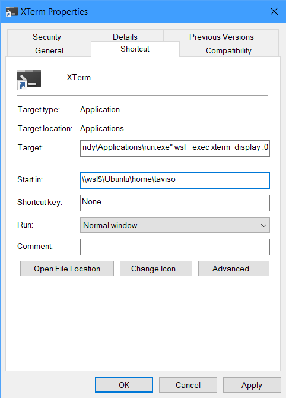

# Minimal run

This is a tiny C program for running Windows commands with a hidden
console. It's suitable for use in Windows shortcuts, i.e. lnk files.

I use `run.exe wsl --exec xterm -display :0` to launch an XTerm on Windows.

If you don't want to compile it yourself, check the [Releases](https://github.com/taviso/minirun/releases) section.

# Building

```
> rc.exe /nologo resource.rc
> cl.exe /nologo  /Zi /O2 /guard:cf /GF /c /Fo:run.obj run.c
> cl.exe /nologo  /Zi /O2 /guard:cf /GF /MT /Fe:run.exe run.obj resource.res /link  user32.lib
```

> Note: You need to build it as a 64bit application to access wsl.exe.

# Screenshot

You can't see it running because it's designed to be invisible! Your
shortcut should look something like this.



# Troubleshooting

First try this to make sure run is working:

```
run.exe calc
```

If that does work, but starting a wsl application doesn't work, it may be a
PATH issue.

Try using the full path instead, like this:

```
run.exe wsl --exec /usr/bin/program
```

If you need to set `$DISPLAY` or some other variable, use `env`. For example,
like this:

```
run.exe wsl --exec env DISPLAY=:0 /usr/bin/program
```

If you have multiple distributions installed, remember to specify the one you
want, e.g.

```
run.exe wsl --distribution Debian --exec /usr/bin/foobar
```

